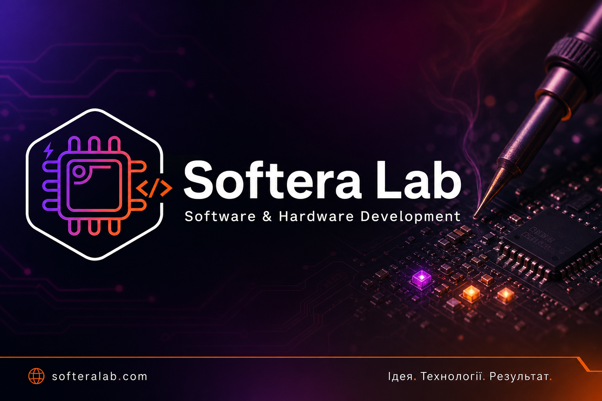

**From soldering and schematics to Arduino, STM32, and Embedded.**  
Custom electronics, prototypes, and firmware for your project.  

[🔗 softeralab.com](https://www.softeralab.com/) · [Join us](https://www.softeralab.com/join-us/) · [Contact](https://www.softeralab.com/our-contacts/)

---

## About Softera Lab

Softera Lab is an embedded systems lab. We run soldering kits and workshops, practical programs in electronics and programming, and custom development from schematic to working prototype.

We help you:
- learn SMD soldering and circuit basics on real kits;
- follow guided tracks in C#, Arduino, STM32, Embedded, and Fusion 360;
- order custom electronics, prototypes, and software for your task.

---

## Formats

### Practical programs
Six guided tracks — from programming to electronics and 3D.

- C#, Arduino, STM32, Embedded
- Electronics soldering, Fusion 360
- [Browse programs](https://www.softeralab.com/)

### Workshops
Short hands-on events on a focused topic — no long commitment.

- Current schedule: [Events](https://www.softeralab.com/our-events/)
- Price depends on topic and materials

### Custom development & prototypes
Built for your brief: electronics, prototype, 3D part.

- Electronics and firmware development
- Prototyping, including 3D printing
- [Services](https://www.softeralab.com/commercial-electronic-development/)

---

## Programs

| Track | Level |
| --- | --- |
| [C# programming](https://www.softeralab.com/course-basic-sharp) | Start from zero |
| [Arduino](https://www.softeralab.com/course-basic-arduino/) | Foundation |
| [STM32](https://www.softeralab.com/course-basic-stm32/) | Foundation |
| [Embedded development](https://www.softeralab.com/course-embedded-start/) | Deeper practice |
| [Electronics soldering](https://www.softeralab.com/course-basic-soldering/) | Assembly practice |
| [3D modeling · Fusion 360](https://www.softeralab.com/course-basic-fusion360/) | Models for prototype and print |

Program and workshop pricing follows each announcement. Custom development and prototyping get an individual quote. Details via [Contact](https://www.softeralab.com/our-contacts/).

---

## Services

We take a project from idea to a working prototype: schematics, PCBs, engineering samples, and integrated firmware.

- **Electronics** — circuits, PCB design, prototypes for testing
- **Embedded** — MCU firmware and control systems
- **Interfaces** — PC apps for MCU control, monitoring, integration

Scope and quote after a short project brief.  
[Describe your task](https://www.softeralab.com/our-contacts/)

---

## Our products on GitHub

We publish kits, schematics, and documentation for practice.

Repository links will appear here after publishing. Featured projects are pinned below.

- [SMD Solder Kit SK40](https://github.com/SofteraLab/smd-solder-kit-sk40) — SMD 0603/0805/1206 soldering practice board SK40 

---

## Have fun!

Choose a format · Write to us · Practice at Softera Lab.
